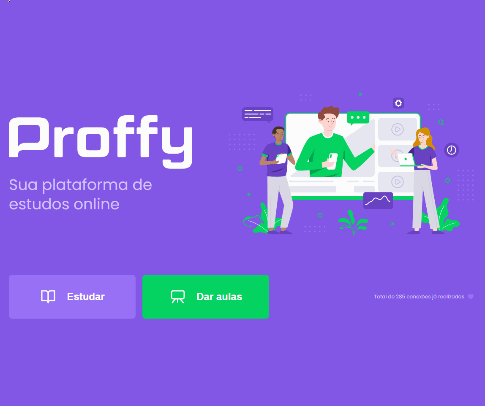

<!-- Badges session -->
<p align="center">
  

  
  
  <a href="https://github.com/K-Schaeffer/NLW-2/commits/master">
    
  </a>
  
  <a href="https://www.linkedin.com/in/k-schaeffer/">
    
  </a>
  
  <a href="https://nextlevelweek.com/episodios/discovery/1/edicao/2">
    
  </a>
  
    
</p>

<!--Banner session-->
<h1 align="center">
    
</h1>

<!--Status session-->
<h4 align="center"> 
	🚧  Proffy 👨‍🏫 Concluído ✔️ 🚧
</h4>

<!-- Index session-->
<p align="center">
 <a href="#-sobre-o-projeto">Sobre</a> •
 <a href="#-funcionalidades">Funcionalidades</a> • 
 <a href="#-layout">Layout</a> • 
 <a href="#-preview">Preview</a> • 
 <a href="#-como-executar-o-projeto">Executando</a> • 
 <a href="#-tecnologias">Tecnologias</a> • 
 <a href="#-licença">Licença</a>
</p>

<!--About session-->
## 💻 Sobre o projeto

Projeto desenvolvido durante a **NLW #2- Next Level Week 2** oferecida pela [Rocketseat](https://nextlevelweek.com/episodios/discovery/1/edicao/2).
O NLW é uma experiência online com muito conteúdo prático, desafios e hacks onde o conteúdo fica disponível durante uma semana.

👨‍🏫 Proffy - O projeto surgiu com a missão de trazer uma homenagem aos educadores do Brasil, através de uma plataforma que conecta alunos e professores de diversas matérias.  Todo o desenvolvimento foi feito na semana do dia nacional dos profissionais de educação. 
<br>A mim este projeto teve o caráter fundamental de reforçar as bases do desenvolvimento front-end, principalmente com HTML e CSS.

---

<!--Functionalities session-->
## ⚙️ Funcionalidades

- [x] Professores podem se cadastrar na plataforma através de um formulário no qual preenchem seus dados:
  - [x] nome completo
  - [x] link de uma foto
  - [x] número de whatsapp
  - [x] breve biografia
  - [x] matéria que será lecionada
  - [x] custo hora/aula
  - [x] horários disponíveis

- [x] Alunos podem buscar professores e:
  - [x] filtrar por matéria, dia da semana e horário
  - [x] entrar em contato diretamente no whatsapp de determinado professor
  
---

<!--Layout session-->
## 🎨 Layout
<p align="center">
<a href="https://www.figma.com/file/GHGS126t7WYjnPZdRKChJF/Proffy-Web">
  
</a>
</p>

### Web

<p align="center" style="display: flex; align-items: flex-start; justify-content: center;">
  
  
  
</p>

### Mobile

<p align="center">
  
  
</p>

---

<!--Preview session-->
## 📺 Preview

<p align="center">

</p>

---

<!--Running session-->
## 🚀 Como executar o projeto

Este projeto consiste em três partes:
1. [Frontend](/src/views/pages) 
2. [Backend](/src/server.js) 
3. [Database](/src/database) 

<!--💡Obs-->

### Pré-requisitos

* [Git](https://git-scm.com)
* [Node.js](https://nodejs.org/en/)

#### 🎲 Rodando o projeto

```bash

# Clone o repositório
$ git clone https://github.com/K-Schaeffer/NLW-2.git

# Acesse a pasta do projeto no prompt de comando
$ cd NLW-2

# Instale as dependências
$ npm install

# Execute o script "dev"
$ npm run dev

# O projeto inciará na porta: 3000 - acesse http://localhost:3000 

```

Opcionalmente, você pode desejar ter uma base de dados limpa, para isso:

```bash

# Delete o arquivo database.sqlite
$ rm -r src/database/database.sqlite

# Execute o arquivo para criação das tabelas
$ node src/database/db.js

```

Feito isso, basta executar o procedimento de rodar o projeto, cadastrar professores, e buscá-los ;)

---

<!--Tecnologies session-->
## 🛠 Tecnologias

As seguintes ferramentas foram usadas na construção do projeto:

#### **Front-end**  ([HTML](https://developer.mozilla.org/pt-BR/docs/Web/HTML)  +  [CSS](https://developer.mozilla.org/pt-BR/docs/Web/CSS) + [JS](https://developer.mozilla.org/pt-BR/docs/Web/JavaScript))

#### **Back-end**  ([NodeJS](https://nodejs.org/en/))

-   **[Express](https://expressjs.com/)**
-   **[Nunjucks](https://mozilla.github.io/nunjucks/)**
-   **[Nodemon](https://nodemon.io)**

> Veja o arquivo [package.json](./package.json)

#### **Database**  ([Sqlite-Async](https://www.npmjs.com/package/sqlite-async))

#### **Utilitários**

-   Editor:  **[Visual Studio Code](https://code.visualstudio.com/)**  → Extensions:  **[SQLite](https://marketplace.visualstudio.com/items?itemName=alexcvzz.vscode-sqlite)**
-   Layout:  **[Figma](https://www.figma.com/)**  →  **[Layout (Proffy)](https://www.figma.com/file/GHGS126t7WYjnPZdRKChJF/Proffy-Web)**
-   Markdown:  **[EmojiCopy](https://www.emojicopy.com)**,  **[Markdown Emoji](https://gist.github.com/rxaviers/7360908)**
-   Badges:  **[Shields.io](https://shields.io)**


<!--License session-->
## 📝 Licença

Este projeto está sob a licença [MIT](./LICENSE).

---

<!--Bottom session-->
<h4 align=center>Feito com ❤️ por Kauan Schaeffer 👋 <a href="https://www.linkedin.com/in/k-schaeffer/">Entre em contato :)</a></a></h4>
