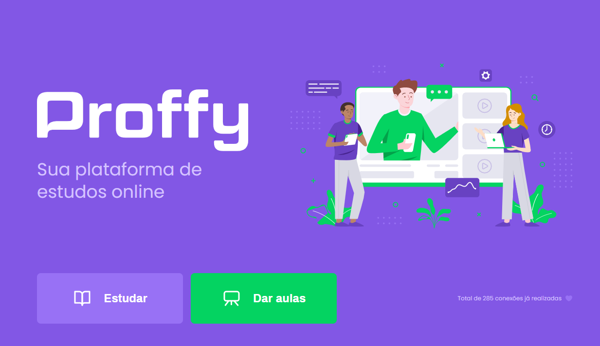
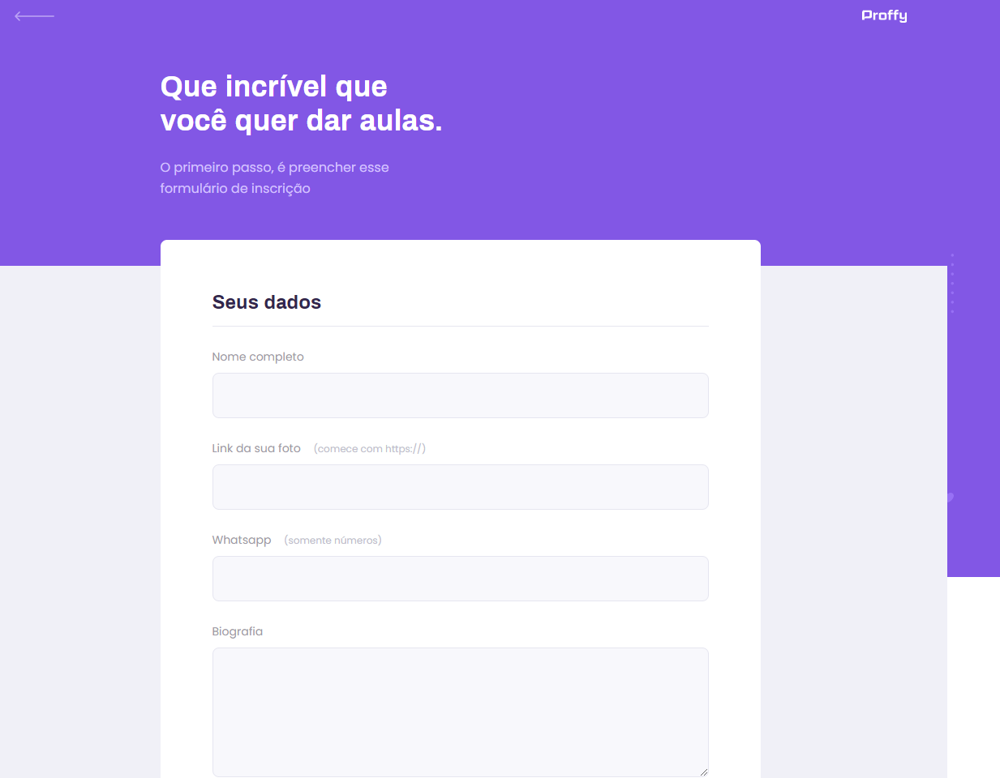
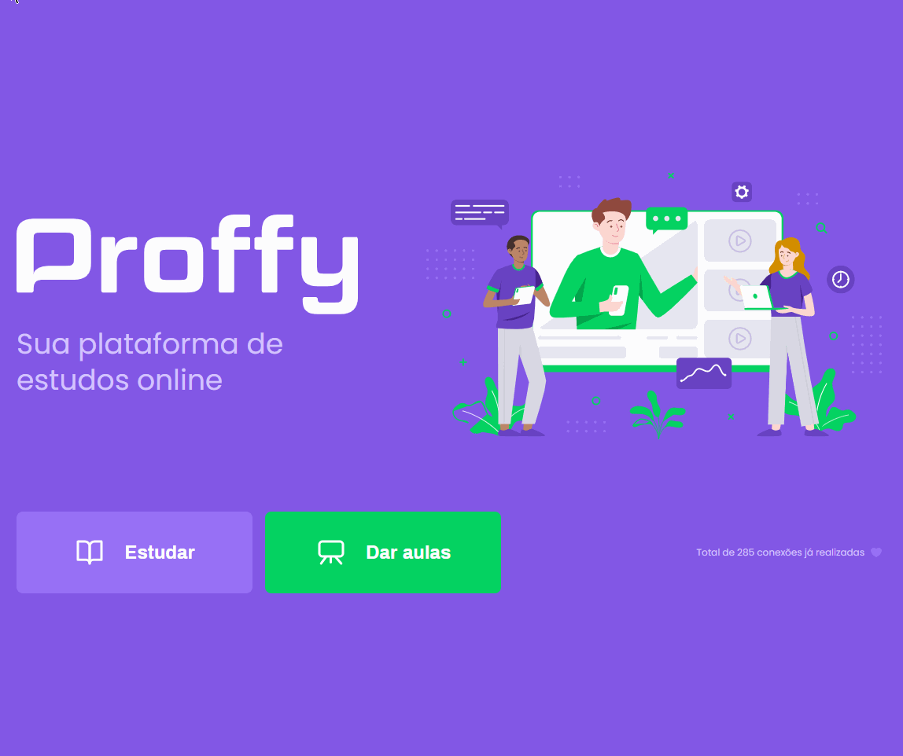

<!-- Badges session -->
<p align="center">
  

  
  
  <a href="https://github.com/K-Schaeffer/NLW-2/commits/master">
    
  </a>
  
  <a href="https://www.linkedin.com/in/k-schaeffer/">
    
  </a>
  
  <a href="https://nextlevelweek.com/episodios/discovery/1/edicao/2">
    
  </a>
  
    
</p>

<p align="center">
    	
	<a href="https://github.com/K-Schaeffer/NLW-2/blob/master/README.md">
    		
  	</a>

	
</p>

<!--Banner session-->
<h1 align="center">
    
</h1>

<!--Status session-->
<h4 align="center"> 
	🚧  Proffy 👨‍🏫 Completed ✔️ 🚧
</h4>

<!-- Index session-->
<p align="center">
 <a href="#-about-the-project">About</a> •
 <a href="#-functionalities">Functionalities</a> • 
 <a href="#-layout">Layout</a> • 
 <a href="#-preview">Preview</a> • 
 <a href="#-running-the-project">Running Locally</a> • 
 <a href="#-technologies">Technologies</a> • 
 <a href="#-license">License</a>
</p>

<!--About session-->
## 💻 About the project

Project built during the **NLW #2- Next Level Week 2**, which is a brazilian programming event hosted by [Rocketseat](https://nextlevelweek.com/episodios/discovery/1/edicao/2).
The NLW is an online coding experience, with lots of practice, chalenges and tips. All the event happens during one week, after that, the content is removed from the Rocketseat website.

👨‍🏫 Proffy - This project is a tribute to all brazilian teachers that had their special holiday in the week that the project was developed. Proffy is a platform that has the mission to connect teachers and students of all subjects.
<br>To me, this project had a special mission in the reinforcement of the front-end development basis, specially with HTML/CSS.

---

<!--Functionalities session-->
## ⚙️ Functionalities

- [x] Teachers can sign up with a form which they complete their data:
  - [x] name and last name
  - [x] photo
  - [x] whatsapp number
  - [x] biography
  - [x] subject
  - [x] cost of its hour
  - [x] avaliable schedule

- [x] Students can search for teachers and:
  - [x] filter by subject, weekday and hour
  - [x] get in touch directly in the teacher whatsapp number
  
---

<!--Layout session-->
## 🎨 Layout
<p align="center">
<a href="https://www.figma.com/file/GHGS126t7WYjnPZdRKChJF/Proffy-Web">
  
</a>
</p>

### Web

<p align="center" style="display: flex; align-items: flex-start; justify-content: center;">
  
  
  
</p>

### Mobile

<p align="center">
  
  
</p>

---

<!--Preview session-->
## 📺 Preview

<p align="center">

</p>

---

<!--Running session-->
## 🚀 Running the project locally

This project is divided in:
1. [Frontend](/src/views/pages) 
2. [Backend](/src/server.js) 
3. [Database](/src/database) 

<!--💡Obs-->

### Requirements

* [Git](https://git-scm.com)
* [Node.js](https://nodejs.org/en/)

#### 🎲 Running it

```bash

# Clone this repo
$ git clone https://github.com/K-Schaeffer/NLW-2.git

# Access the project folder from the command prompt
$ cd NLW-2

# Install all dependencies
$ npm install

# Execute the "dev" script
$ npm run dev

# Soon the project will start in the port: 3000 - open http://localhost:3000 

```

Opcionally, you may want to have a clean database, therefore:

```bash

# Delete the database.sqlite file
$ rm -r src/database/database.sqlite

# Execute the file which creates all tables
$ node src/database/db.js

```

After that, just run the project, register teachers, and search for them :)

---

<!--Tecnologies session-->
## 🛠 Technologies

The following tools where used in the project development:

#### **Front-end**  ([HTML](https://developer.mozilla.org/pt-BR/docs/Web/HTML)  +  [CSS](https://developer.mozilla.org/pt-BR/docs/Web/CSS) + [JS](https://developer.mozilla.org/pt-BR/docs/Web/JavaScript))

#### **Back-end**  ([NodeJS](https://nodejs.org/en/))

-   **[Express](https://expressjs.com/)**
-   **[Nunjucks](https://mozilla.github.io/nunjucks/)**
-   **[Nodemon](https://nodemon.io)**

> See the [package.json](./package.json) file

#### **Database**  ([Sqlite-Async](https://www.npmjs.com/package/sqlite-async))

#### **Useful tools**

-   Editor:  **[Visual Studio Code](https://code.visualstudio.com/)**  → Extensions:  **[SQLite](https://marketplace.visualstudio.com/items?itemName=alexcvzz.vscode-sqlite)**
-   Layout:  **[Figma](https://www.figma.com/)**  →  **[Layout (Proffy)](https://www.figma.com/file/GHGS126t7WYjnPZdRKChJF/Proffy-Web)**
-   Markdown:  **[EmojiCopy](https://www.emojicopy.com)**,  **[Markdown Emoji](https://gist.github.com/rxaviers/7360908)**
-   Badges:  **[Shields.io](https://shields.io)**


<!--License session-->
## 📝 License

This project is under the [MIT](./LICENSE) license.

---

<!--Bottom session-->
<h4 align=center>Made with ❤️ by Kauan Schaeffer 👋 <a href="https://www.linkedin.com/in/k-schaeffer/">Contact me :)</a></a></h4>
